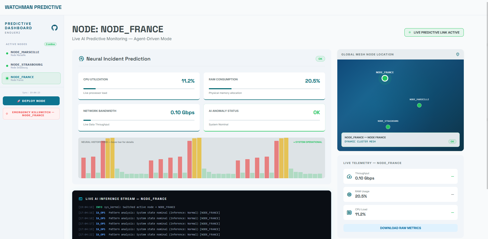
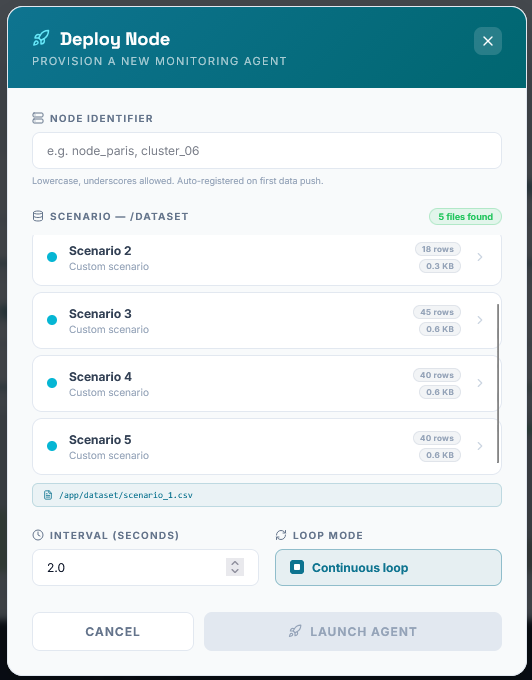

# 📊 Predictive Metrics Dashboard — WATCHMAN_OS

> Un tableau de bord de monitoring intelligent en temps réel, alimenté par un modèle de Machine Learning pour la **détection prédictive d'anomalies** sur des serveurs distribués.

---
[Accéder au Dashboard WATCHMAN_OS](https://dashboard-enguer2.duckdns.org/)

## Aperçu

<p align="center">
  
  <br>
    
  <br>
</p>

## Sommaire

1. [Vue d'ensemble](#1-vue-densemble)
2. [Architecture du projet](#2-architecture-du-projet)
3. [Fonctionnalités](#3-fonctionnalités)
4. [Stack technique](#4-stack-technique)
5. [Démarrage rapide (Docker)](#5-démarrage-rapide-docker)
6. [Configuration](#6-configuration)
7. [API Reference](#7-api-reference)
8. [Structure du projet](#8-structure-du-projet)
9. [Documentation complémentaire](#9-documentation-complémentaire)

---

## 1. Vue d'ensemble

WATCHMAN_OS est une plateforme de monitoring prédictif conçue pour surveiller en temps réel les métriques système (CPU, RAM, réseau) de plusieurs serveurs ou clusters simultanément.

Contrairement à un système d'alertes classique basé sur des **seuils fixes**, WATCHMAN_OS comprend la notion de **comportement** : le modèle d'IA apprend la baseline normale d'un serveur au repos et détecte les déviations comportementales — pics anormaux, montées lentes de RAM, déséquilibres CPU/mémoire — avant qu'ils ne deviennent critiques.

### Cas d'usage typiques

- Détection d'attaques de type Brute Force (accélération soudaine du CPU)
- Détection de fuites mémoire (montée progressive et continue de la RAM)
- Identification de processus parasites (ex : minage de cryptomonnaie)
- Surveillance multi-nodes avec vue globale et par cluster

---

## 2. Architecture du projet

```
predictive-metrics-dashboard/
├── backend/          # API FastAPI + modèle IA (Python)
│   ├── main.py           # Serveur FastAPI WATCHMAN_OS v3.2.0
│   ├── train_model.py    # Pipeline d'entraînement Isolation Forest
│   ├── watchman_agent.py # Agent de collecte et d'envoi des métriques
│   ├── scenario.csv      # Données d'entraînement (baseline normale)
│   └── dataset/          # Scénarios CSV simulés (attaques, pannes…)
├── frontend/         # Interface utilisateur (Next.js + TypeScript)
├── assets/           # Diagrammes d'architecture (SVG)
├── docker-compose.yml
└── .env              # Variables d'environnement (non versionné)
```

Le système repose sur **trois services** orchestrés via Docker Compose :

| Service | Image | Port exposé | Rôle |
|---|---|---|---|
| `db` | PostgreSQL 15 | 5432 | Persistance des métriques historiques |
| `backend` | Python / FastAPI | 8000 | API REST + moteur IA |
| `frontend` | Next.js 16 | 80 → 3000 | Tableau de bord web |

---

## 3. Fonctionnalités

### 🧠 Intelligence Artificielle
- **Détection d'anomalies non supervisée** via Isolation Forest (scikit-learn)
- **Feature engineering** sur 11 indicateurs dérivés (deltas, pression, corrélations CPU/RAM)
- **Score de risque hybride** (ML + règles expertes déterministes) pour éviter le Concept Drift
- **Entraînement par jittering** (augmentation des données par bruit gaussien) pour une baseline robuste

### 📡 Multi-Node Plug & Play
- Enregistrement automatique des agents dès leur première connexion
- Identification unique par session utilisateur (isolation des données entre utilisateurs)
- Killswitch : arrêt complet d'un node (processus + purge base de données)
- Garbage Collector automatique : nettoyage des sessions inactives depuis plus de 15 minutes

### 📊 Dashboard Temps Réel
- Vue globale multi-clusters avec statuts d'alerte (OK / WARNING / CRITICAL)
- Historique des 50 derniers points de chaque node
- Déploiement de nodes simulés directement depuis l'interface (scénarios CSV)
- Niveaux d'alerte colorés : 🟢 Normal · 🟠 Avertissement · 🔴 Critique

---

## 4. Stack technique

### Backend
| Composant | Technologie |
|---|---|
| API REST | FastAPI + Uvicorn |
| IA / ML | scikit-learn (Isolation Forest), NumPy, pandas |
| Base de données | PostgreSQL 15 + SQLAlchemy |
| Sérialisation modèle | joblib |
| Monitoring système | psutil |
| Agent HTTP | requests |

### Frontend
| Composant | Technologie |
|---|---|
| Framework | Next.js 16 (App Router) |
| Langage | TypeScript |
| UI Components | Tremor React |
| Icônes | Lucide React |
| Styles | Tailwind CSS v4 |

---

## 5. Démarrage rapide (Docker)

### Prérequis

- [Docker Desktop](https://www.docker.com/products/docker-desktop/) installé et en cours d'exécution
- Fichier `.env` configuré (voir section [Configuration](#6-configuration))

### Lancer l'application

```bash
# Cloner le dépôt
git clone <url-du-repo>
cd predictive-metrics-dashboard

# Configurer les variables d'environnement
cp .env.example .env  # puis éditer le fichier .env

# Construire et démarrer les services
docker compose up --build
```

L'application sera accessible sur :
- **Frontend** → [http://localhost](http://localhost)
- **API Backend** → [http://localhost:8000](http://localhost:8000)
- **Healthcheck API** → [http://localhost:8000/](http://localhost:8000/)

### Arrêter les services

```bash
docker compose down

# Supprimer également les volumes (réinitialise la DB)
docker compose down -v
```

### Développement local (sans Docker)

**Backend :**
```bash
cd backend
pip install -r requirements.txt
python train_model.py      # Entraîne et sérialise le modèle IA
uvicorn main:app --reload  # Lance l'API en mode développement
```

**Frontend :**
```bash
cd frontend
npm install
npm run dev  # Démarre le serveur Next.js sur http://localhost:3000
```

---

## 6. Configuration

L'application se configure via un fichier `.env` à la racine du projet :

```env
# Base de données PostgreSQL
POSTGRES_USER=<utilisateur>
POSTGRES_PASSWORD=<mot_de_passe>
POSTGRES_DB=dashboard_ops

# URL de connexion utilisée par le backend
DATABASE_URL=postgresql://<utilisateur>:<mot_de_passe>@dashboard-db:5432/dashboard_ops
```

> ⚠️ **Ne jamais versionner le fichier `.env`**. Il est déjà inclus dans `.gitignore`.

---

## 7. API Reference

L'API REST expose les endpoints suivants (version `3.2.0`) :

| Méthode | Route | Description |
|---|---|---|
| `GET` | `/` | Healthcheck — état de l'API et du modèle IA |
| `POST` | `/api/report/{node_id}` | Ingestion des métriques brutes d'un agent |
| `GET` | `/api/nodes` | Liste des nodes actifs de la session courante |
| `GET` | `/api/nodes/status` | Dernier snapshot de chaque node actif |
| `GET` | `/api/scenarios` | Liste les fichiers CSV disponibles dans `/dataset` |
| `POST` | `/api/nodes/deploy` | Déploie un agent simulé (node virtuel) |
| `DELETE` | `/api/nodes/{node_id}` | Killswitch : arrête et purge un node |
| `GET` | `/stats/{node_id}` | Dernier point de données d'un node (polling) |
| `GET` | `/history/{node_id}` | 50 derniers points d'historique d'un node |

### Exemple : ingestion de métriques

```bash
curl -X POST http://localhost:8000/api/report/cluster_01 \
  -H "Content-Type: application/json" \
  -H "X-Session-Id: ma-session-unique" \
  -d '{"cpu": 85.5, "ram": 72.1, "network": 1.3}'
```

Réponse :
```json
{
  "node_id": "cluster_01",
  "is_anomaly": true,
  "ai_risk_score": 74,
  "alert_level": "CRITICAL"
}
```

### Niveaux d'alerte IA

| Score de risque | Niveau | Signification |
|---|---|---|
| > 70 | 🔴 `CRITICAL` | Anomalie confirmée, intervention requise |
| 40 – 70 | 🟠 `WARNING` | Comportement suspect, à surveiller |
| < 40 | 🟢 `OK` | Fonctionnement normal |

---

## 8. Structure du projet

```
backend/
├── main.py             # Cœur de l'API FastAPI (routes, logique métier, IA)
├── train_model.py      # Script d'entraînement et de sérialisation du modèle
├── watchman_agent.py   # Agent autonome de collecte et d'envoi de métriques
├── scenario.csv        # 18 lignes : baseline normale + scénarios d'attaque
├── requirements.txt    # Dépendances Python
├── Dockerfile
└── dataset/            # Fichiers CSV de scénarios supplémentaires

frontend/
├── app/                # Pages Next.js (App Router)
├── components/         # Composants React réutilisables
├── lib/                # Utilitaires et appels API
├── public/             # Assets statiques
├── package.json
└── Dockerfile

assets/
├── svg_architecture_fr.svg  # Schéma d'architecture (français)
└── svg_architecture_en.svg  # Schéma d'architecture (anglais)
```

---

## 9. Documentation complémentaire

Pour une description détaillée de l'architecture IA (choix du modèle, feature engineering, stratégie d'entraînement, système de décision hybride) :

📄 **[`backend/README.md`](./backend/README.md)** — Architecture IA & détection d'anomalies (FR + EN)

---

*WATCHMAN_OS v3.2.0 — Projet de monitoring prédictif*

<br><br><br>

---

<div align="center">

🇬🇧 **English version below** · 🇫🇷 *Version française ci-dessus*

</div>

---

<br>

# 📊 Predictive Metrics Dashboard — WATCHMAN_OS

> A real-time intelligent monitoring dashboard powered by a Machine Learning model for **predictive anomaly detection** on distributed servers.

---

[Access the WATCHMAN_OS Dashboard](https://dashboard-enguer2.duckdns.org/)

## Dashboard Preview

<p align="center">
  
  <br>
    
  <br>
</p>


## Table of Contents

1. [Overview](#1-overview)
2. [Project Architecture](#2-project-architecture)
3. [Features](#3-features)
4. [Tech Stack](#4-tech-stack)
5. [Quick Start (Docker)](#5-quick-start-docker)
6. [Configuration](#6-configuration)
7. [API Reference](#7-api-reference)
8. [Project Structure](#8-project-structure)
9. [Additional Documentation](#9-additional-documentation)

---

## 1. Overview

WATCHMAN_OS is a predictive monitoring platform designed to observe system metrics (CPU, RAM, network) across multiple servers or clusters simultaneously, in real time.

Unlike a traditional alert system based on **fixed thresholds**, WATCHMAN_OS understands the concept of **behavior**: the AI model learns the normal baseline of a server at rest and detects behavioral deviations — abnormal spikes, slow RAM growth, CPU/memory imbalances — before they become critical.

### Typical Use Cases

- Detection of Brute Force attacks (sudden CPU acceleration)
- Detection of memory leaks (gradual and continuous RAM increase)
- Identification of rogue processes (e.g., cryptocurrency mining)
- Multi-node monitoring with global and per-cluster views

---

## 2. Project Architecture

```
predictive-metrics-dashboard/
├── backend/          # FastAPI + AI model (Python)
│   ├── main.py           # FastAPI server WATCHMAN_OS v3.2.0
│   ├── train_model.py    # Isolation Forest training pipeline
│   ├── watchman_agent.py # Metrics collection and reporting agent
│   ├── scenario.csv      # Training data (normal baseline)
│   └── dataset/          # Simulated CSV scenarios (attacks, failures…)
├── frontend/         # User interface (Next.js + TypeScript)
├── assets/           # Architecture diagrams (SVG)
├── docker-compose.yml
└── .env              # Environment variables (not versioned)
```

The system relies on **three services** orchestrated via Docker Compose:

| Service | Image | Exposed Port | Role |
|---|---|---|---|
| `db` | PostgreSQL 15 | 5432 | Historical metrics persistence |
| `backend` | Python / FastAPI | 8000 | REST API + AI engine |
| `frontend` | Next.js 16 | 80 → 3000 | Web dashboard |

---

## 3. Features

### 🧠 Artificial Intelligence
- **Unsupervised anomaly detection** via Isolation Forest (scikit-learn)
- **Feature engineering** across 11 derived indicators (deltas, pressure, CPU/RAM correlations)
- **Hybrid risk score** (ML + deterministic expert rules) to prevent Concept Drift
- **Jittering-based training** (Gaussian noise data augmentation) for a robust baseline

### 📡 Multi-Node Plug & Play
- Automatic agent registration on first connection
- Unique per-user session identification (data isolation between users)
- Killswitch: complete node shutdown (process termination + database purge)
- Automatic Garbage Collector: cleanup of sessions inactive for more than 15 minutes

### 📊 Real-Time Dashboard
- Global multi-cluster view with alert statuses (OK / WARNING / CRITICAL)
- History of the last 50 data points per node
- Simulated node deployment directly from the UI (CSV scenarios)
- Color-coded alert levels: 🟢 Normal · 🟠 Warning · 🔴 Critical

---

## 4. Tech Stack

### Backend
| Component | Technology |
|---|---|
| REST API | FastAPI + Uvicorn |
| AI / ML | scikit-learn (Isolation Forest), NumPy, pandas |
| Database | PostgreSQL 15 + SQLAlchemy |
| Model serialization | joblib |
| System monitoring | psutil |
| HTTP agent | requests |

### Frontend
| Component | Technology |
|---|---|
| Framework | Next.js 16 (App Router) |
| Language | TypeScript |
| UI Components | Tremor React |
| Icons | Lucide React |
| Styling | Tailwind CSS v4 |

---

## 5. Quick Start (Docker)

### Prerequisites

- [Docker Desktop](https://www.docker.com/products/docker-desktop/) installed and running
- `.env` file configured (see [Configuration](#6-configuration) section)

### Start the Application

```bash
# Clone the repository
git clone <repo-url>
cd predictive-metrics-dashboard

# Set up environment variables
cp .env.example .env  # then edit the .env file

# Build and start the services
docker compose up --build
```

The application will be available at:
- **Frontend** → [http://localhost](http://localhost)
- **API Backend** → [http://localhost:8000](http://localhost:8000)
- **API Healthcheck** → [http://localhost:8000/](http://localhost:8000/)

### Stop the Services

```bash
docker compose down

# Also remove volumes (resets the DB)
docker compose down -v
```

### Local Development (without Docker)

**Backend:**
```bash
cd backend
pip install -r requirements.txt
python train_model.py      # Train and serialize the AI model
uvicorn main:app --reload  # Start the API in development mode
```

**Frontend:**
```bash
cd frontend
npm install
npm run dev  # Start the Next.js server at http://localhost:3000
```

---

## 6. Configuration

The application is configured via a `.env` file at the project root:

```env
# PostgreSQL database
POSTGRES_USER=<user>
POSTGRES_PASSWORD=<password>
POSTGRES_DB=dashboard_ops

# Connection URL used by the backend
DATABASE_URL=postgresql://<user>:<password>@dashboard-db:5432/dashboard_ops
```

> ⚠️ **Never version the `.env` file**. It is already listed in `.gitignore`.

---

## 7. API Reference

The REST API exposes the following endpoints (version `3.2.0`):

| Method | Route | Description |
|---|---|---|
| `GET` | `/` | Healthcheck — API and AI model status |
| `POST` | `/api/report/{node_id}` | Ingest raw metrics from an agent |
| `GET` | `/api/nodes` | List active nodes for the current session |
| `GET` | `/api/nodes/status` | Latest snapshot of each active node |
| `GET` | `/api/scenarios` | List CSV files available in `/dataset` |
| `POST` | `/api/nodes/deploy` | Deploy a simulated agent (virtual node) |
| `DELETE` | `/api/nodes/{node_id}` | Killswitch: stop and purge a node |
| `GET` | `/stats/{node_id}` | Latest data point for a node (polling) |
| `GET` | `/history/{node_id}` | Last 50 historical data points for a node |

### Example: Metrics Ingestion

```bash
curl -X POST http://localhost:8000/api/report/cluster_01 \
  -H "Content-Type: application/json" \
  -H "X-Session-Id: my-unique-session" \
  -d '{"cpu": 85.5, "ram": 72.1, "network": 1.3}'
```

Response:
```json
{
  "node_id": "cluster_01",
  "is_anomaly": true,
  "ai_risk_score": 74,
  "alert_level": "CRITICAL"
}
```

### AI Alert Levels

| Risk Score | Level | Meaning |
|---|---|---|
| > 70 | 🔴 `CRITICAL` | Confirmed anomaly, intervention required |
| 40 – 70 | 🟠 `WARNING` | Suspicious behavior, monitor closely |
| < 40 | 🟢 `OK` | Normal operation |

---

## 8. Project Structure

```
backend/
├── main.py             # FastAPI core (routes, business logic, AI)
├── train_model.py      # Model training and serialization script
├── watchman_agent.py   # Autonomous metrics collection and reporting agent
├── scenario.csv        # 18 rows: normal baseline + attack scenarios
├── requirements.txt    # Python dependencies
├── Dockerfile
└── dataset/            # Additional CSV scenario files

frontend/
├── app/                # Next.js pages (App Router)
├── components/         # Reusable React components
├── lib/                # Utilities and API calls
├── public/             # Static assets
├── package.json
└── Dockerfile

assets/
├── svg_architecture_fr.svg  # Architecture diagram (French)
└── svg_architecture_en.svg  # Architecture diagram (English)
```

---

## 9. Additional Documentation

For a detailed description of the AI architecture (model selection, feature engineering, training strategy, hybrid decision system):

📄 **[`backend/README.md`](./backend/README.md)** — AI Architecture & Anomaly Detection (FR + EN)

---

*WATCHMAN_OS v3.2.0 — Predictive monitoring project*
